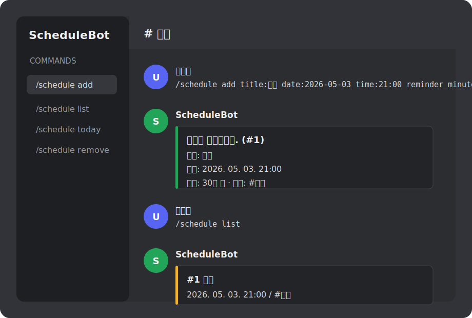

# ScheduleBot

TypeScript 기반 Discord 일정관리 봇입니다.

서버 안에서 일정을 등록하고, 다가오는 일정이나 오늘 일정을 확인하고, 지정한 시간에 채널로 알림을 받을 수 있습니다.



## 주요 기능

- `/schedule add`로 일정 등록
- `/schedule list`로 다가오는 일정 확인
- `/schedule today`로 오늘 일정 확인
- `/schedule remove`로 일정 삭제
- SQLite 파일 기반 일정 저장
- 봇 실행 중 30초마다 알림 대상 일정 확인

## 설치

```bash
npm install
```

PowerShell에서 `npm` 실행 정책 오류가 나면 `npm.cmd`를 사용하세요.

```bash
npm.cmd install
```

## 환경 변수

`.env.example`을 복사해서 `.env`를 만들고 값을 채워주세요.

```env
DISCORD_TOKEN=your_bot_token_here
DISCORD_CLIENT_ID=your_application_client_id_here
```

각 값의 의미는 다음과 같습니다.

| 이름 | 설명 |
| --- | --- |
| `DISCORD_TOKEN` | Discord Developer Portal의 봇 토큰 |
| `DISCORD_CLIENT_ID` | 애플리케이션 ID |

## 명령어 등록

봇이 초대된 모든 서버에서 사용할 수 있도록 전역 슬래시 명령어를 등록합니다.

```bash
npm.cmd run deploy:commands
```

전역 명령어는 Discord에 반영되기까지 시간이 걸릴 수 있습니다. 보통 몇 분 안에 보이지만, 경우에 따라 더 오래 걸릴 수 있습니다.

정상 등록되면 다음과 비슷한 로그가 나옵니다.

```text
[info] Registered 4 global slash commands.
```

## 실행

```bash
npm.cmd run dev
```

봇이 정상 로그인하면 다음과 비슷한 로그가 나옵니다.

```text
[info] Logged in as ScheduleBot#0000
```

## 일정 등록하기

기본 사용 예시입니다.

```text
/schedule add title:회의 date:2026-05-03 time:21:00 reminder_minutes:30 channel:#일정 description:주간 회의
```

옵션 설명:

| 옵션 | 필수 | 설명 |
| --- | --- | --- |
| `title` | 예 | 일정 제목 |
| `date` | 예 | 날짜, 예: `2026-05-03` |
| `time` | 예 | 시간, 예: `21:00` |
| `reminder_minutes` | 아니오 | 몇 분 전에 알림을 보낼지, 기본값 `30` |
| `channel` | 아니오 | 알림을 보낼 채널, 없으면 명령어를 입력한 채널 |
| `description` | 아니오 | 일정 설명 |

등록 후 봇은 이런 식으로 응답합니다.

```text
일정이 등록됐어요. (#1)
제목: 회의
시간: 2026. 05. 03. 21:00
알림: 30분 전
채널: #일정
```

## 일정 확인하기

다가오는 일정 목록:

```text
/schedule list
```

오늘 일정 목록:

```text
/schedule today
```

응답 예시:

```text
#1 회의
   2026. 05. 03. 21:00 / #일정
   주간 회의
```

## 일정 삭제하기

`/schedule list`에서 확인한 ID로 삭제합니다.

```text
/schedule remove id:1
```

응답 예시:

```text
#1 일정을 삭제했어요.
```

## 알림 예시

일정 시간이 가까워지면 지정한 채널로 알림이 전송됩니다.

```text
일정 알림: 회의
30분 후 일정이 시작돼요.
시간: 2026. 05. 03. 21:00
내용: 주간 회의
등록자: @사용자
```

## 프로젝트 구조

```text
src/
  commands/          슬래시 명령어
  config/            환경 변수 설정
  db/                SQLite 연결과 마이그레이션
  events/            Discord 이벤트 핸들러
  services/          일정 저장/알림 로직
  types/             공용 타입
  utils/             날짜/로그 유틸
  deploy-commands.ts 슬래시 명령어 등록 스크립트
  index.ts           봇 진입점
```

## 데이터 저장

일정 데이터는 로컬 SQLite 파일에 저장됩니다.

```text
data/schedulebot.db
```

이 파일은 `.gitignore`에 포함되어 있어 Git에 올라가지 않습니다.
