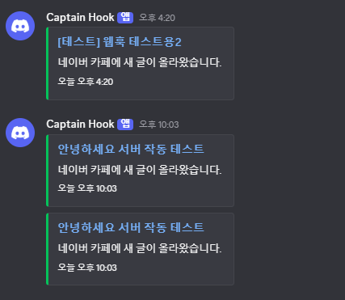

# alarmForDiscord

네이버 카페 게시판에 새 글이 올라오면 Discord 웹훅으로 알림을 보내는 Node.js 앱입니다.

## 사용 예시



## 준비

1. Node.js 18 이상을 설치합니다.
2. Discord 채널 설정에서 웹훅 URL을 만듭니다.
3. `.env.example`을 참고해 `.env` 파일을 만듭니다.

```env
DISCORD_WEBHOOK_URL=https://example.com/discord-webhook
NAVER_CAFE_LIST_URL=https://example.com/naver-cafe-board
POLL_INTERVAL_SECONDS=60
```

네이버 카페가 로그인이나 멤버십을 요구하면 브라우저 개발자 도구에서 해당 게시판 요청의 `Cookie` 헤더를 복사해 `NAVER_COOKIE`에 넣어야 합니다. `.env`는 커밋하지 마세요.

## 실행

```bash
npm test
npm start
```

첫 실행에서는 기존 글을 상태 파일에 저장만 하고 알림을 보내지 않습니다. 기존 글도 모두 알림으로 받고 싶다면 `NOTIFY_EXISTING_ON_START=true`를 설정하세요.

## 서버에서 계속 실행

SSH 창을 닫아도 계속 실행하려면 서버에서 다음처럼 실행합니다.

```bash
nohup npm start > alarm.log 2>&1 &
```

실행 여부와 로그는 다음 명령으로 확인합니다.

```bash
ps -ef | grep "node src/index.js" | grep -v grep
tail -n 30 alarm.log
```

더 안정적으로 운영하려면 PM2를 사용할 수 있습니다.

```bash
npm install pm2
npx pm2 start src/index.js --name alarm-for-discord --time
npx pm2 status
```

## 동작 방식

- `NAVER_CAFE_LIST_URL`에서 `cafeId`와 `menuId`를 추출합니다.
- 네이버 카페 글 목록 API를 주기적으로 호출합니다.
- 새 글이면 Discord 웹훅에 임베드 메시지를 보냅니다.
- 이미 본 글 ID는 `data/seen-articles.json`에 저장해 중복 알림을 막습니다.

## 주의

Discord 웹훅 URL, 네이버 쿠키, 개인 설정값은 절대로 커밋하지 마세요. 공개 가능한 예시는 `.env.example`에만 작성하고, 실제 운영 값은 각 실행 환경의 `.env`에만 저장하세요.
